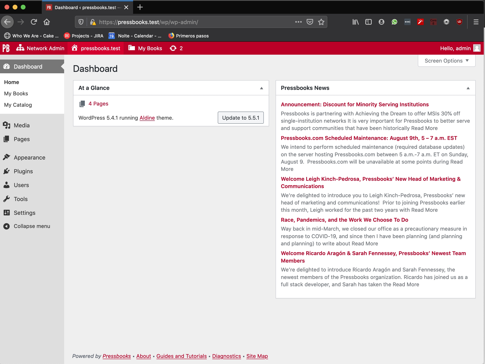
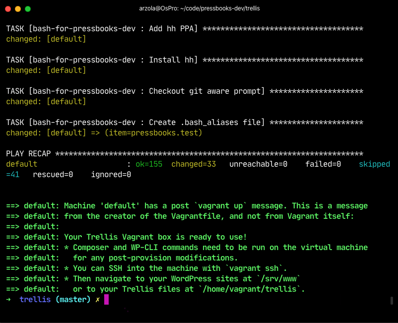

# Pressbooks excersices

### 1. Explain the differences between HEAD, GET and POST in the HTTP

GET, POST and HEAD are http methods that are used to send data from one point to another, in this case webservers that listen for this verbs.

**GET** verb is mainly used to fetch data, and perform queries using URL params.

**POST** verb is used to send data using form data object, multipart or even binary files, also is used in API endpoints as a way to create resources.

**HEAD** verb is used like a GET to be able to get the content length of an endpoint without having to donwload the response. 


## 2. Convert the following procedural PHP7 code into object oriented style

```php
function make_astronaut( string $name, float $weight ) {

    return [ 'name' => $name, 'weight' => $weight ];

}


function add_weight_to_astronaut( array &$astronaut, float $pounds ) {

    $astronaut['weight'] += $pounds;

}


function launch_astronaut( array $astronaut ) {

    if ( $astronaut['weight'] > 200 ) {

        echo "{$astronaut['name']} too heavy, grounded.\n";

    } else {

        echo "{$astronaut['name']} going where no human has gone before.\n";

    }

}
```

Please run the unit tests using `vendor/bin/pest --filter Astronaut`

You'll find the entire test suite in `tests/PressbooksTest.php`

#### Example

```php
test('if weight can be added to the astronaut', function() {

    $astronaut = new Astronaut('Maria',100);

    $astronaut->addWeight(40);

    $this->assertEquals(140,$astronaut->weight);

});
```

Please find the source code of `Astronaut::class` into the `src/Astronaut.php` file


## 3 - You are given the following table in database **nasa**:

`CREATE TABLE astronaut ( name text, weight int );`

Write a simple PHP page that displays a form to enter the name and weight of an astronaut and on submission enters those values into the database. (Simple in this case means you do not have to be fancy, but you still need to be complete and correct. Assume the database is running on the local host and use user nasa and password nasa to connect).

Use a DB abstraction layer to write your code. Example: PDO or WPDB. Use prepared statements.

Please run the unit tests using `vendor/bin/pest --filter Db`

Open `index.html` and `insert.php`

## 4 - You have a group of people that are taking courses from a given list of courses. Write ANSI compliant SQL statements that will do the following:

* Create the tables that allow any person to take any course, but only allow them to sign up for any given course once

```sql
CREATE TABLE Users (
    id int AUTO_INCREMENT,
    name varchar(50),
    email varchar(60), 
    PRIMARY KEY (id)
);
```

```sql
CREATE TABLE Courses (
    id int AUTO_INCREMENT,
    course varchar(50), 
    PRIMARY KEY (id)
);
```

```sql
CREATE TABLE Users_Courses (
    id int AUTO_INCREMENT,
    course varchar(50), 
    PRIMARY KEY (id)
);

CREATE UNIQUE INDEX allow_once ON Users_Courses 
(`user_id`,`course_id`) USING BTREE;
```

* . show all courses taken by a given person.


```sql
SELECT Courses.course FROM Users_Courses 
JOIN Courses ON Users_Courses.course_id = Courses.id
WHERE Users_Courses.user_id = 1
```

* show all people and the number of courses they are taking

```sql
SELECT Users.name,
    (SELECT Count(*) FROM Users_Courses WHERE Users_Courses.user_id = Users.id) AS total_courses 
FROM Users 
```

## 5. Given the following string:

```php
$str = 'drinking giving jogging 喝 喝 passing 制图 giving 跑步 吃';
```

Using PHP, write a function that:

 1. Moves all Chinese characters to the end of the string, reversing their current order.

 2. Removes duplicate English words.

 3. Returns the modified string
 
 Please run the unit tests using `vendor/bin/pest --filter Chinese`
 
```php
test('chinese string is correctly interpolated', function() {

    $string = 'drinking giving jogging 喝 喝 passing 制图 giving 跑步 吃';

    $result = cleanFancyString($string);

    $this->assertEquals('drinking giving jogging passing吃步跑图制喝喝',$result);

});
```

Please find the source code of `cleanFancyString()` into the `src/helpers/clean.php` file

## 6 - Use a GitHub Branch as a Composer Dependency

You can find this implementation on this project I'm using a library that I created before

`composer.json`

* Add a repositores key into the `composer.json` schema to specify the VCS repositories that will be used if the dependencies are not resolved on packagist.
* Add the dependency into the require or require-dev if is a development package, prefixing the desired branch with `dev` like the following example:

```
 pressbooks/new-private-project:dev-bugfixes
```
* Probably you'll need to add `"minimum-stability": "dev"` to your composer schema to be able to install non stable branches. 

## 7. Get Pressbooks working locally and attach a screenshot showing that you could do it. 

1. I had to remove the `| change filter in the yaml configuration file`
2. I added the `use function Env\env` namespace import in application.php to register the `env()` function in the current scope
3. I fixed the `createImmutable` static call in the DotEnv call






## 8. This string contains information about this test. Can you determine what its significance is?

It's just my IP address connection and the timestamp base64 encoded 🕵️‍♂️
